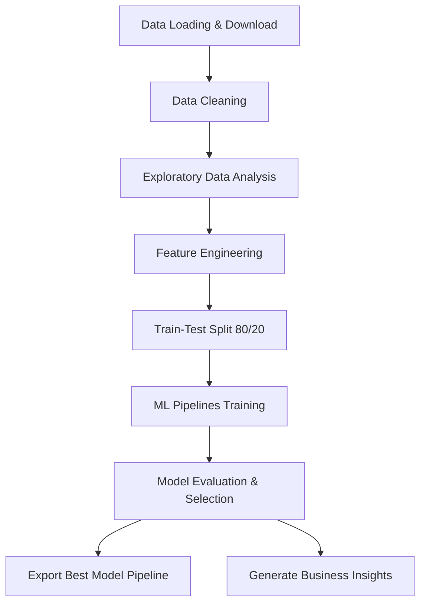
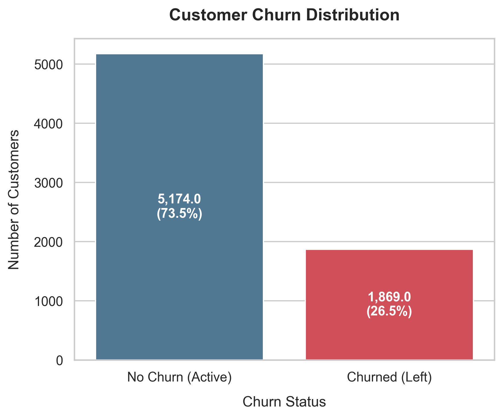
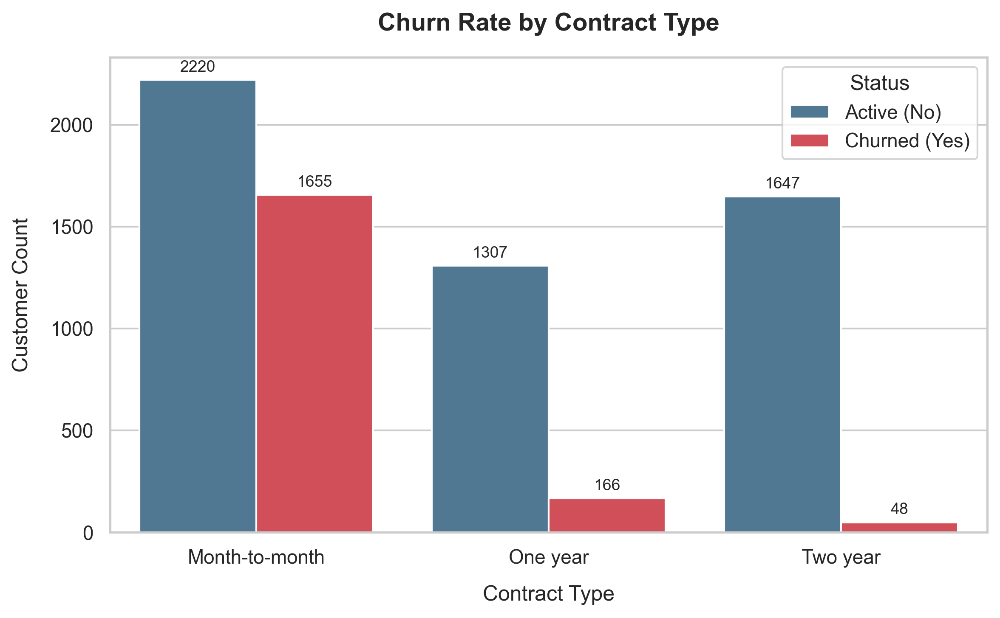
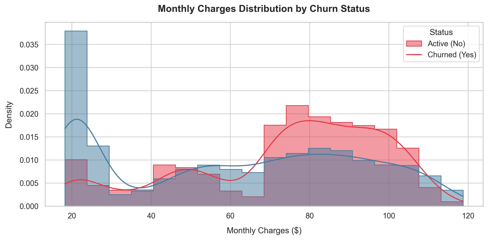
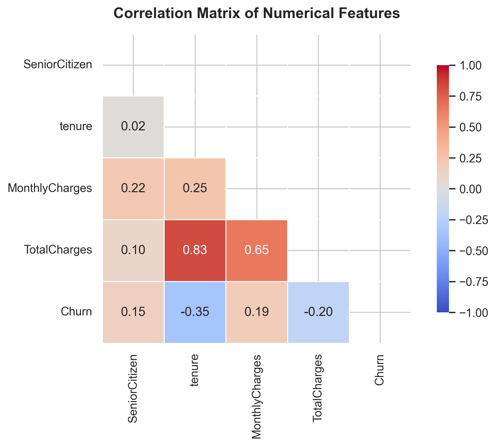
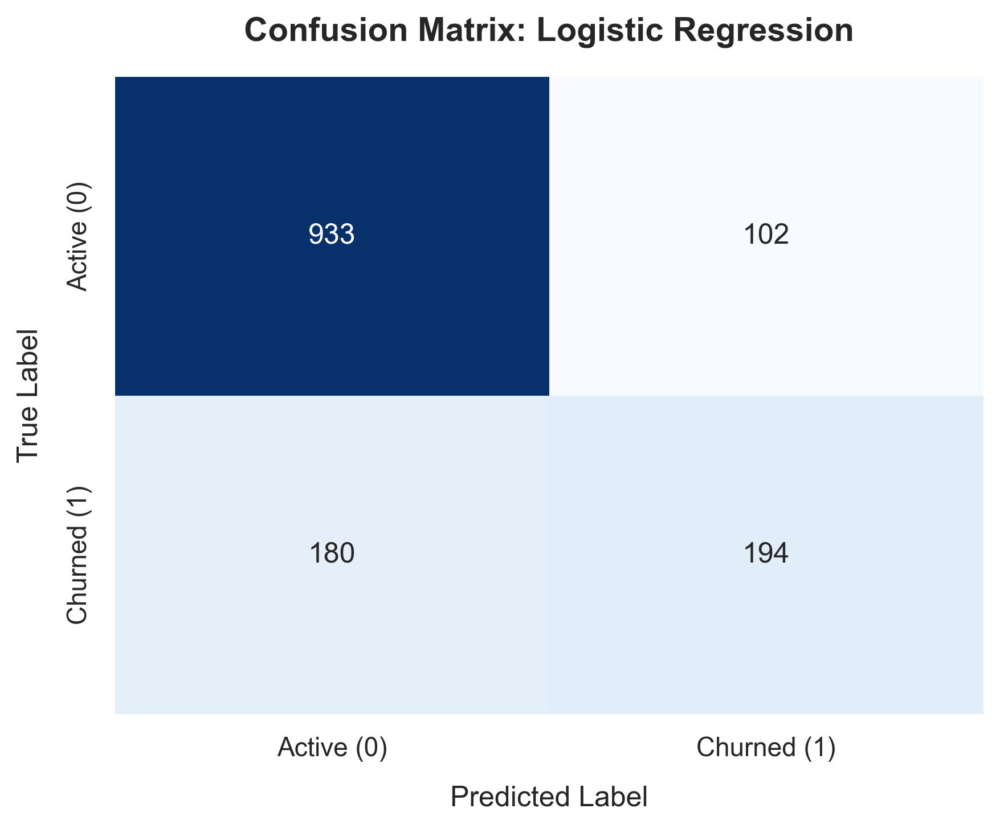

# Customer Churn Prediction System

An end-to-end, production-style, and beginner-friendly machine learning project designed to predict customer churn in the telecom industry using **Scikit-learn**. This project is portfolio-ready, interview-ready, and demonstrates clean modular software design, rigorous exploratory data analysis (EDA), proper preprocessing pipelines, model training/evaluation, and strategic business insights.

---

## 📌 Project Overview
Customer churn is one of the most critical metrics for any subscription-based business. Acquiring new customers is often significantly more expensive than retaining existing ones. This system analyzes customer characteristics (demographics, subscription types, payment channels, billing amounts) and uses machine learning classification algorithms to:
1. **Identify** which customers are at high risk of churning (leaving the company).
2. **Discover** the primary drivers of churn.
3. **Formulate** actionable business strategies to increase retention.

---

## 📊 Dataset Information
The project uses the classic **Telco Customer Churn Dataset** (IBM). The dataset contains 7,043 rows and 21 columns:
- **Demographics**: `gender`, `SeniorCitizen`, `Partner`, `Dependents`
- **Subscription Details**: `tenure` (months active), `PhoneService`, `MultipleLines`, `InternetService`, `OnlineSecurity`, `OnlineBackup`, `DeviceProtection`, `TechSupport`, `StreamingTV`, `StreamingMovies`
- **Billing Behavior**: `Contract`, `PaperlessBilling`, `PaymentMethod`, `MonthlyCharges`, `TotalCharges`
- **Target Variable**: `Churn` (Yes/No)

*Note: The dataset is downloaded automatically from public resources when you run the pipeline.*

---

## 🛠️ Technologies Used
- **Language**: Python 3.13
- **Data Manipulation**: Pandas, NumPy
- **Data Visualization**: Matplotlib, Seaborn
- **Machine Learning**: Scikit-learn
- **Model Storage**: Joblib

---

## ⚙️ Machine Learning Workflow



1. **Data Cleaning**:
   - Converted `TotalCharges` to numeric.
   - Handled blank values (representing new customers with 0 tenure) by replacing them with `0.0`.
   - Removed duplicates.
   - Standardized target column `Churn` to binary integers `(1 = Yes, 0 = No)`.
2. **Exploratory Data Analysis (EDA)**:
   - Evaluated churn rates across contract terms, payment modes, billing sizes, and relationship lengths.
   - Output high-quality plots to `outputs/charts/`.
3. **Feature Engineering**:
   - Categorized customer `tenure` into distinct intervals (`TenureGroup`).
   - Structured a production-grade `ColumnTransformer` with:
     - `StandardScaler` for numeric continuous features (`tenure`, `MonthlyCharges`, `TotalCharges`).
     - `OneHotEncoder` with `drop='first'` for categorical features to prevent multicollinearity and data leakage.
4. **Model Training**:
   - Evaluated three different classifiers: **Logistic Regression**, **Decision Tree Classifier**, and **Random Forest Classifier**.
   - Integrated the preprocessor and estimator into single-callable Scikit-learn `Pipeline` structures.
5. **Model Evaluation & Selection**:
   - Compared models on **Accuracy, Precision, Recall, and F1-Score**.
   - Plotted individual confusion matrices.
   - Saved the champion model (preprocessing + estimator) to disk.

---

## 📈 Results & Performance

Below is the model comparison table generated on the test set:

| Model | Accuracy | Precision | Recall | F1-Score |
| :--- | :---: | :---: | :---: | :---: |
| **Logistic Regression** | **80.34%** | **65.03%** | **55.61%** | **59.95%** |
| **Random Forest** | 79.56% | 64.67% | 49.73% | 56.22% |
| **Decision Tree** | 78.49% | 61.27% | 51.34% | 55.87% |

### Key Findings
* **Logistic Regression** is the best performing model based on F1-Score (**59.95%**) and Recall (**55.61%**). 
* In churn prediction, higher Recall is critical because it identifies a larger fraction of customers who will actually leave, allowing targeted retention campaigns to intercept them.

---

## 🖼️ Exploratory Data Analysis & Screenshots

Here are the key visualization insights saved in `outputs/charts/`:

### 1. Customer Churn Distribution
*Shows the proportion of active vs churned customers.*


### 2. Churn Rate by Contract Type
*Highlights that month-to-month contracts are highly prone to churn.*


### 3. Monthly Charges Distribution
*Shows that churned customers pay higher average monthly bills ($74.44 vs $61.30 for active ones).*


### 4. Correlation Matrix of Numerical Features
*Visualizes collinearity between features (e.g., strong correlation between tenure and TotalCharges).*


### 5. Champion Model Confusion Matrix
*Confusion matrix of the selected Logistic Regression model.*


---

## 🚀 Setup & Execution Instructions

### Prerequisites
- Python 3.10+ installed on your system.

### 1. Clone & Navigate to the Project
```bash
cd Customer-Churn-Prediction-System
```

### 2. Install Dependencies
Install all required libraries using:
```bash
pip install -r requirements.txt
```

### 3. Run the ML Pipeline
Execute the main entry point to run data downloading, cleaning, plotting, model training, evaluation, saving, and report compilation:
```bash
python main.py
```

### 4. Open the Jupyter Notebook
To run the step-by-step interactive workflow, launch Jupyter:
```bash
jupyter notebook notebooks/churn_analysis.ipynb
```

---

## 📁 Project Structure
```text
Customer_Churn_Prediction/
│
├── data/
│   └── WA_Fn-UseC_-Telco-Customer-Churn.csv   # Downloaded raw dataset
│
├── notebooks/
│   └── churn_analysis.ipynb                    # Step-by-step analysis notebook
│
├── src/
│   ├── data_cleaning.py                        # Downloader & cleaner
│   ├── feature_engineering.py                  # Binning & ColumnTransformers
│   ├── model_training.py                       # Trainer pipelines
│   ├── evaluation.py                           # Metric calculators
│   └── visualization.py                        # Plotting code
│
├── outputs/
│   ├── charts/                                 # Saved PNG visualizations
│   ├── reports/                                # model_comparison.csv & business_insights.txt
│   └── models/                                 # Best saved model pipeline (.joblib)
│
├── requirements.txt                            # Dependency list
├── README.md                                   # Documentation
└── main.py                                     # Pipeline runner
```
